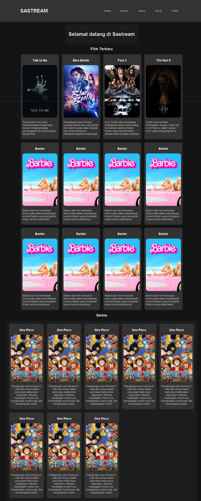
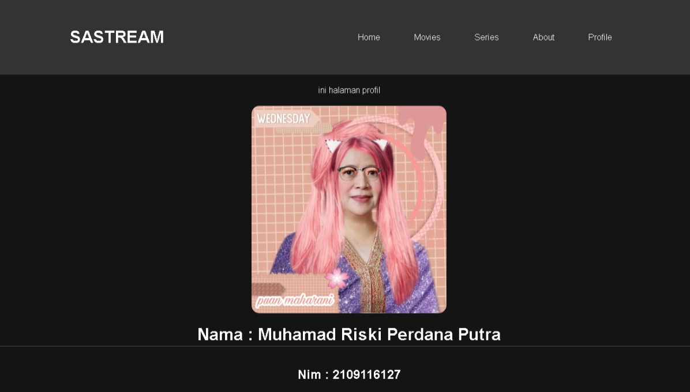

Saya mengerjakan posttest 1 framework dengan tema streaming film dan series, yang saya beri nama Sastream. Alasannya adalah karena streaming film dan series adalah tren yang sedang berkembang dan banyak diminati oleh masyarakat. Selain itu, membangun platform streaming memberikan tantangan teknis yang menarik dan banyak pelajaran berharga tentang pengembangan web. Platform ini juga memiliki potensi untuk digunakan oleh banyak orang dan jika berhasil dibangun dengan baik, bisa menjadi populer. Terakhir, tema ini memberi saya ruang yang luas untuk berekspresi secara kreatif dalam merancang tampilan situs dan fitur interaktif.

ini adalah tampilan untuk halaman home dari website yang saya buat

dan ini adalah tampilan sementara halaman profil dari website saya

<!-- #NOTE -->
<!-- Untuk gambar demo nya saya masukkan kedalam folder DEMO WEBSITE -->